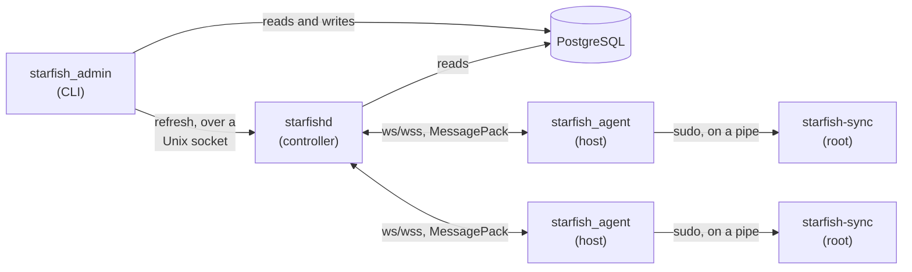

# Starfish

Starfish is a system that allows you to easily synchronize users, SSH keys, security groups, and sudo privileges across Linux systems.

## How It Works



- **`starfish_db`** holds the [Toasty](https://docs.rs/toasty) models that define
  the schema.
- **`starfish_msg`** holds the wire protocol shared by everything else: the controller/agent messages, the admin socket messages, and the `AgentKey` type. Messages are MessagePack, encoded by field name so adding a field does not break a peer built against an older version.
- **`starfishd`** is the controller. It connects to PostgreSQL, serves agents over a WebSocket, and listens on a Unix domain socket for administrative nudges. When an agent connects it is sent the configuration for its host.
- **`starfish_agent`** runs on each Ubuntu host as an unprivileged service account. It connects to the controller, sends a heartbeat on a timer, and hands each configuration to the helper below. It never talks to the database and never changes the host itself.
- **`starfish_sync`** is the small privileged helper the agent invokes through `sudo`. It is the only part that runs as root
- **`starfish_admin`** is the CLI. It reads and writes the database directly and contacts the controller only to trigger a refresh.

## Installing

Each release publishes versioned `.zip` files for an agent and a controller. Currently, the targets  `aarch64-unknown-linux-gnu` and `x86_64-unknown-linux-gnu` are supported.

Install the controller first. Set `VERSION` and `TUPLE` env variables, e.g. `v1.0.0` and  `aarch64-unknown-linux-gnu`.

Then:

```bash
curl -L -O "https://github.com/jlyonsmith/starfish/releases/download/$VERSION/starfish-controller-$VERSION-$TUPLE.zip"
unzip "starfish-controller-$VERSION-$TUPLE.zip"
cd "starfish-controller-$VERSION-$TUPLE"
sudo ./install-controller.sh
```

The script will ask for the PostgreSQL server details, TLS certificate and key, create a database if it is missing, apply the database schema, apply the necessary database roles, create a service account `starfishd`, and start the controller under `systemd`.

Passwords for the `starfish_owner` and `starfishd` roles will be automatically generated, and written to `/etc/starfish/owner.password` and `/etc/starfish/db.password` at mode `0600`. The script also asks about a TLS certificate to enable secure WebSockets, and the access group for the admin socket (which is optional).

Run `starfish-admin host add` to add a host.  Then install the agent on the host (you'll need the key the `add` operation printed).  Set `VERSION` and `TUPLE` as above (make sure they match):

```sh
curl -L -O "https://github.com/jlyonsmith/starfish/releases/download/$VERSION/starfish-agent-$VERSION-$TUPLE.zip"
unzip starfish-agent-v0.1.0-aarch64-unknown-linux-gnu.zip
cd starfish-agent-v0.1.0-aarch64-unknown-linux-gnu
sudo ./install-agent.sh
```

This script will ask for the controller URL and the agent key, and install the service account, the privileged helper, the sudo rule and the unit. For a `wss://` controller using an internal CA, you'll be asked to install the CA's root certificate. Without the agent cannot connect to the controller.  Certbot installations don't need to do this.

Both all install scripts are safe to run again. Everything is compared before it is written, so a second run on a correctly configured host reports that nothing changed and does not restart the service.

You can supply flags to each of the scripts for unattended installs. `--help` lists them `--non-interactive` never prompts. Values already in the configuration file are used as defaults, so a re-run with no arguments repairs an installation without changing it.

## Administration

### TLS on the Controller

If you supply a PEM certificate chain and its private key the controller will serve `wss://` instead of `ws://`.  You have to supply both a key and a certificate chain. PKCS#8, PKCS#1 and SEC1 keys all work. You can use a privately generated certificate, or use something like [Certbot](https://certbot.eff.org/).

Keys may not live under `/home` because `starfishd.service` sets `ProtectHome=yes`. So, to install a self generated certificate and key, copy them somewhere in your `HOME` directory before running the installer and supply them to the script on the command line or interactively. The `install-controller.sh` script will copy the certificate to `/etc/starfish/server.crt` and the key to `/etc/starfish/server.key`.

Otherwise, the script leaves the keys where they are so a renewal does not require re-running `install-controller.sh`. With certbot that means pointing the `tls_cert` and `tls_key` config settings at `/etc/letsencrypt/live/<name>/fullchain.pem` and `privkey.pem` directly. The `live` and `archive` directories are `0700 root:root`, so the controller cannot read through them until a deploy hook opens the path and restarts it. Here's an example hook file:

```sh
# /etc/letsencrypt/renewal-hooks/deploy/starfishd.sh
chgrp starfishd /etc/letsencrypt/live /etc/letsencrypt/archive
chmod 0750 /etc/letsencrypt/live /etc/letsencrypt/archive
chgrp starfishd /etc/letsencrypt/archive/<name>/privkey*.pem
chmod 0640 /etc/letsencrypt/archive/<name>/privkey*.pem
systemctl reload-or-restart starfishd
```

### TLS on the Agent

Agents verify the controller against the **system trust store**. For a certificate signed by an internal CA, you can upload the CA certificate to each host and give the location of the file when prompted, and the script will install it for you. You can ignore this for public certificates or if you already have the certificate installed.  `SSL_CERT_FILE`, but this is mostly just useful for testing.

### Configuration

A **host group** ties people to machines. Every **host** belongs to one host group, and every **user** in that host group gets an account on every host in it. Adding a user to a host group also names the **security groups** they belong to on its hosts — ordinary Linux groups, given with `--security-group` and stored on the membership itself. Users add any number of **SSH keys** and the agent installs them on the hosts in the `$HOME/.ssh` directory. Users are also made sudoers on the system by adding them to a special `starfish_sudo` group to allow the password-less sudo.  

> There is not mechanism to set a users password current in Starfish.

`starfishd` reads a TOML file in `/etc/starfishd.conf`, then environment variables (if applicable) then the command line.

The format of the config file is:

```toml
sql_server = "postgresql://starfish@db.example.com:5432/starfish"
listen = "0.0.0.0:9600"
tls_cert = "/etc/starfish/server.crt"
tls_key = "/etc/starfish/server.key"
```

`starfishd` also uses a Unix socket to enable the `refresh` command to prompt connected agents to pick-up new configuration.  The socket is created mode `0600` for the owner and `0660` for `admin_socket_group` so administrators with their own accounts run `starfish-admin refresh` without having to `sudo`.

> `/run` is writable only by root, and the controller deliberately is not root, so its socket lives in a systemd `RuntimeDirectory` at `/run/starfishd/starfishd.sock`. `/etc/tmpfiles.d/starfishd.conf` points `/run/starfishd.sock` at it, recreated on each boot because `/run` is emptied, so `starfish-admin` still finds the socket at its default path.

`starfish_agent` reads a TOML file at `/etc/starfish_agent.conf`, then environment (if applicable) then the command line.

The format of the config file is:

```toml
controller_url = "wss://starfish.example.com:9600"
agent_key = "r7FevxIWzpBxVHRd"
```

The agent does not need root.  It runs in an unprivileged `starfish` account. It uses a helper running as `root` that takes no command line arguments, and is fed data via stdin to actually make changes. A lot of configuration work is done by the install script to sandbox the both the agent and its helper.

Note, anyone who can write to the database can add a sudo user to any host with an agent. The install script locks down the database using several roles. You can add controller users to the `starfish_admins` group role. Give each administrator their own login that matches their controller login, which gives them Unix socket peer access to the database:

```sh
sudo -u postgres psql -d starfish \
    -c 'CREATE ROLE <user-name> LOGIN IN ROLE starfish_admins'
```

Then they can do operations using this URL:

```sh
starfish-admin -p 'postgresql:///starfish?host=/var/run/postgresql' user list
```

Set `STARFISH_SQL_SERVER` to that URL rather than retyping it. 

You can give administrators working from another machine need a password each instead if you need too. A password in the connection URL is visible in `ps` output to every user on the machine, and goes to\ shell history. All tools take `--password-file` instead, which must be mode `0600`. `starfish-admin` also reads `STARFISH_PASSWORD_FILE`, and takes the server URL from `STARFISH_SQL_SERVER`.

To set a password, do the following:

```sh
install -m 0600 /dev/null /etc/starfish/db.password
printf '%s' 'the password' > /etc/starfish/db.password

starfishd --sql-server postgresql://starfishd@db.example.com/starfish \
    --password-file /etc/starfish/db.password
```

PostgreSQL `sslmode` defaults to `prefer`, which uses TLS when the server offers it but accepts plaintext and never checks who it is talking to. You can ask for verification explicitly with:

```url
postgresql://starfishd@db.example.com/starfish?sslmode=verify-full&sslrootcert=system
```

`sslrootcert` is **required** with `verify-ca` and `verify-full` — the driver does not fall back to `~/.postgresql/root.crt`. Use `system` for the operating system trust store, or a path for an internal CA. Pair it with `hostssl ... scram-sha-256` entries in `pg_hba.conf`, restricted to the addresses the controller and administrators connect from.

To do `refresh` you need to also add the user to the local `starfish-admins` group:

```sh
groupadd --system starfish-admins
usermod -aG starfish-admins <USER>

starfishd ... --admin-socket-group starfish-admins
```

What Starfish will change on a host is decided by a tag it writes into each
account's `GECOS` field, `STARFISH-<id>`, where the id is the database's own
and is the one thing about a user that never changes:

```text
ada:x:1001:1001:Ada Lovelace,,,,STARFISH-42:/home/ada:/bin/bash
```

A hyphen rather than a colon because `shadow` refuses `:`, `,` and `=` in any
`GECOS` field, and for the same reason the tag is written with `chfn`, which
writes the fields one at a time, rather than `usermod --comment`, which cannot
write the comma in front of it. The whole field is Starfish's: the full name
keeps the first field, the room and phone fields are emptied, and the tag has
the last.

The tag is what makes the following possible:

- **A user removed from the database loses the account**, along with its home
  directory and anything in it, on the next sync of every host they were on.
  This is reported as *removed* and logged by the controller as a warning,
  because it follows from an ordinary edit — taking somebody out of a host
  group — and is the most destructive thing a sync does.
- **A user whose alias changes keeps the account.** The tag's id, not the login
  name, is what an account is recognised by, so the alias change becomes a
  `usermod --login` and the uid, the home directory and everything in it stay
  where they are. The account's private group keeps the old name, which nothing
  depends on.
- **An account without the tag is not Starfish's to delete.** A local account
  that no configuration mentions is left alone completely.

An account that a configuration *does* name but that has no tag is adopted:
tagged, and managed from then on. That is what carries hosts across an upgrade,
where every existing account predates tagging — but it also means a local
account whose name happens to collide with a configured alias is taken over,
its full name and `authorized_keys` overwritten. The agent logs a warning
naming the account whenever it adopts one, which is the notice that the two
cases look identical from the host.

Otherwise synchronizing is deliberately additive:

- **Groups are never created or deleted.** They are administered outside Starfish and are expected to exist on the host already; the agent only moves users in and out of them. A group in the configuration that the host does not have is reported as *missing* and logged as a warning by both the agent and the controller, naming the users who are going without the access it was meant to give them — it is not a failure, and everything else in the configuration is still applied.
- **Group membership is removed**, but only for groups the controller sent. A user in `docker` keeps `docker` even though Starfish knows nothing about it. This is the only way to revoke access, which is why it is the exception.
- **Sudo is membership of the `starfish-sudo` group**, granted and revoked like any other managed group rather than through a per-user `sudoers.d` file. That group, not Ubuntu's own `sudo`, because managed accounts have **no password at all** — people authenticate with an SSH key — and so could never answer the prompt that the stock `%sudo ALL=(ALL:ALL) ALL` rule demands. `deploy/starfish-sudoers` gives `starfish-sudo` a `NOPASSWD` rule instead. `scripts/install-agent.sh` creates the group. If it is missing, `--sudoer` grants nothing and says so in the log.
- **`~/.ssh/authorized_keys` is owned outright.** The agent writes a header and exactly the keys in the database, so local edits are overwritten. A user with no keys in the database ends up with a file containing only the header, and loses key based access, so populate `ssh_keys` before rolling agents out.
- New users are created with `--create-home` and `/bin/bash`, and **no password**. The account is usable over SSH with a key and cannot be logged into with a password at all.

`starfish-sync` runs standard Ubuntu tools: `useradd`, `usermod`, `userdel`, `chfn`, `gpasswd`, `getent` and `id` — no `groupadd`, `groupdel` or `groupmod`, which the agent has no way to reach. Group membership uses `gpasswd`, not `usermod --groups`, because the latter replaces a user's whole supplementary list and would silently drop unmanaged groups.

Agents authenticate with a 16 character alphanumeric key generated by `host add`. Show it again with `host show`, or replace it with `host rekey`, after which that host's agent cannot reconnect until its configuration is updated.

Each heartbeat tells the controller when to expect the next one. The controller records `contacted_at` and `next_heartbeat_at` (the promised interval plus a 60 second grace), capping the interval at an hour so a broken agent cannot declare itself healthy indefinitely. `host list -v` and `host show` report this as `OK`, `Overdue` or `Unknown`.

A disconnected agent reconnects with a backoff that doubles from 1 to 60 seconds. When the controller rejects its key the backoff keeps growing rather than resetting, so a misconfigured host does not hammer the controller — but it does keep trying, so fixing the database is enough to bring it back without logging into the host.

## Development

If you are developing Starfish, this is a breakdown of the steps you'll need to take:

```sh
brew install sd colima docker
```

Install Rust with `rustup`.  `clone` the repo. Configure a `colima` VM.  Then:

```sh
cargo build --release       # binaries land in target/release
createdb starfish
```

Then configure a system. `starfish-admin` talks to the database directly, so this works before the controller is running. These commands use its default connection, `postgresql://localhost:5432/starfish`; pass `-p` as a demonstration:

```sh
starfish-admin init-db

# People
starfish-admin user add --alias ada --first-name Ada --last-name Lovelace \
    --email ada@example.com --ssh-key "laptop:ssh-ed25519 AAAAC3Nz..."

# A group of machines
starfish-admin host-group add --name web

# Who gets an account, with sudo and the Linux groups they belong to
starfish-admin host-group add-user --name web --alias ada --sudoer \
    --security-group developers

# A machine.  This prints the key its agent authenticates with.
starfish-admin host add --hostname web-1 --host-group web
```

Now start the controller:

```sh
starfishd --sql-server postgresql://localhost:5432/starfish
```

Then set `web-1` up, using the key printed by `host add`. The agent runs as a service account rather than as root.

```sh
adduser --system --group --no-create-home --shell /usr/sbin/nologin starfish

install -o root -g root -m 0755 -D starfish-sync /usr/local/lib/starfish/starfish-sync
install -o root -g root -m 0755 starfish-agent /usr/local/bin/starfish-agent
install -o root -g root -m 0440 deploy/starfish-sync.sudoers /etc/sudoers.d/starfish

printf 'controller_url = "ws://starfish.example.com:9600"\nagent_key = "r7FevxIWzpBxVHRd"\n' \
    > /etc/starfish_agent.conf
chown root:starfish /etc/starfish_agent.conf && chmod 0640 /etc/starfish_agent.conf

install -o root -g root -m 0644 deploy/starfish-agent.service /etc/systemd/system/
systemctl enable --now starfish-agent
```

The agent connects, receives its configuration, and creates the accounts. After changing anything in the database, push it out immediately:

```sh
starfish-admin refresh                     # every host
starfish-admin refresh --hostname web-1    # just one
```

### Testing

Most of the test suite needs nothing external — `starfish_sync` is tested against a fake host, so the synchronization logic, the validation and the wire handling all run anywhere, including macOS.

```sh
just test           # everything that needs nothing external
just test-db        # the controller, against PostgreSQL
just test-ubuntu    # the privileged helper, against Ubuntu in a container
just test-systemd   # the agent under systemd, on an Ubuntu VM
just test-all       # all of them
```

**`test-db`** starts the real `starfishd` binary and drives it as both an agent and the admin tool. It **drops and recreates** the database you point it at, so use one kept for testing.

**`test-ubuntu`** runs `starfish-sync` as root inside `ubuntu:24.04`, which is the only way to test the half that actually changes a host: the unit tests use a fake, and macOS has no `useradd` or `getent`. It builds the image from `docker/Dockerfile.test`, installing the binaries and the real `deploy/starfish-sync.sudoers` exactly as the README describes, then checks against `getent`, `id` and `stat` that

- a user is created with the right home, shell and full name, and lands in the right groups,
- `~/.ssh/authorized_keys` ends up `ada:ada` mode `600` inside a `.ssh` at `700`,
- a second run reports everything `Unchanged`,
- sudo is granted and revoked through the `sudo` group,
- a group the controller never sent survives, while membership of one it did send is removed,
- a system account and a name that would be read as an option are both refused, and nothing acquires uid 0,
- and the sudoers rule works: the unprivileged `starfish` account can run `starfish-sync` through `sudo -n`, and cannot run `useradd`.

Any Docker will do; it is developed against [colima](https://github.com/abiosoft/colima). The image builds the Linux binaries in a `rust` stage, because cross compiling from macOS needs a linker that is not installed by default. The first build takes a few minutes; afterwards a cargo cache mount keeps it quick.

**`test-systemd`** goes one step further, into a [Lima](https://lima-vm.io) VM running real Ubuntu with real systemd. It runs `scripts/install-agent.sh` — the same script the release archive ships, so the installer cannot drift from what it is meant to do — runs the controller on the Mac, and then checks that the unit starts, that the agent is unprivileged inside its sandbox, and that a real account appears in the VM. That last part exercises the whole chain at once: systemd sandbox, agent, sudo, helper, `useradd`.

It also pins the three sandbox settings that must stay *off*. The helper is a child of the agent's unit and inherits its mount namespace, so `ProtectHome=yes`, `ProtectSystem=strict` and `NoNewPrivileges=yes` each look like an improvement and each silently break account management.

The VM is created on first use and left running afterwards; remove it with `limactl delete -f starfish-test`.

### Releasing

`just release [incrPatch|incrMinor|incrMajor]` drives the version from `version.json5` into the three binary crates with `stampver`, runs `test-all`, tags and pushes, and then cross compiles both Linux targets. Do not hand-edit those version fields.

```sh
just build-macos          # aarch64-apple-darwin, a native build
just build-linux-arm64    # aarch64-unknown-linux-gnu, in Docker
just build-linux-amd64    # x86_64-unknown-linux-gnu, in Docker
just build-all            # all three

just release              # version, test, tag, push, build
just bundle               # the four archives, into scratch/publish
just publish              # upload them to a draft GitHub release
```

The two Linux targets build inside `docker/Dockerfile.build` on a local Colima VM; `aarch64-apple-darwin` is a plain native build, because cross compiling to Darwin would need the macOS SDK in the container.

`just publish` leaves the release a **draft**, with placeholder notes. Write the notes on GitHub and publish it there. Running it again re-uploads the archives over the existing ones, so a rebuild can be pushed to a draft that is already open.

## Known limitations

- **The schema is created, not migrated.** `starfishd` creates it on first run and skips that on later runs, but a model change after the first run needs the tables updated separately. Toasty has a `migration` feature that is not enabled here.
- **There is no HTTPS endpoint.** Agents get their configuration over the WebSocket only.
- **Nothing acts on an overdue host.** The controller records when a heartbeat was due and `host list` will show it as overdue, but you have to look; there is no alerting.
