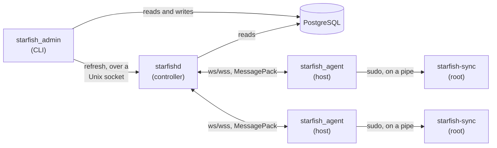

# Starfish

Starfish synchronizes user accounts from a PostgreSQL database onto Ubuntu hosts. You describe who should have an account where, and agents running on each host create the users and groups to match.

## How it works



- **`starfish_db`** holds the [Toasty](https://docs.rs/toasty) models that define
  the schema.
- **`starfish_msg`** holds the wire protocol shared by everything else: the controller/agent messages, the admin socket messages, and the `AgentKey` type. Messages are MessagePack, encoded by field name so adding a field does not break a peer built against an older version.
- **`starfishd`** is the controller. It connects to PostgreSQL, serves agents over a WebSocket, and listens on a Unix domain socket for administrative nudges. When an agent connects it is sent the configuration for its host.
- **`starfish_agent`** runs on each Ubuntu host as an unprivileged service account. It connects to the controller, sends a heartbeat on a timer, and hands each configuration to the helper below. It never talks to the database and never changes the host itself.
- **`starfish_sync`** is the small privileged helper the agent invokes through `sudo`. It is the only part that needs root. See [Privileges](#privileges).
- **`starfish_admin`** is the CLI. It reads and writes the database directly and contacts the controller only to trigger a refresh.

## Installing

Each release publishes versioned `.zip` files for an agent and a controller. Currently, the targets  `aarch64-unknown-linux-gnu` and `x86_64-unknown-linux-gnu` are supported.

Install the controller first. Set `VERSION` and `TUPLE` env variables, e.g. `v1.0.0` and  `aarch64-unknown-linux-gnu`.

Then:

```bash
curl -L -O "https://github.com/jlyonsmith/starfish/releases/download/$VERSION/starfish-controller-$VERSION-$TUPLE.zip"
unzip "starfish-controller-$VERSION-$TUPLE.zip"
cd "starfish-controller-$VERSION-$TUPLE"
sudo ./install-controller.sh
```

The script will ask for the PostgreSQL server details, TLS certificate and key, create a database if it is missing, apply the database schema, apply the necessary database roles, create a service account `starfishd`, and start the controller under `systemd`.

Passwords for the `starfish_owner` and `starfishd` roles will be automatically generated, and written to `/etc/starfish/owner.password` and `/etc/starfish/db.password` at mode `0600`. The script also asks about a TLS certificate to enable secure WebSockets, and the access group for the admin socket (which is optional).

Run `starfish-admin host add` to add a host.  Then install the agent on the host (you'll need the key the `add` operation printed).  Set `VERSION` and `TUPLE` as above (make sure they match):

```sh
curl -L -O "https://github.com/jlyonsmith/starfish/releases/download/$VERSION/starfish-agent-$VERSION-$TUPLE.zip"
unzip starfish-agent-v0.1.0-aarch64-unknown-linux-gnu.zip
cd starfish-agent-v0.1.0-aarch64-unknown-linux-gnu
sudo ./install-agent.sh
```

This script will ask for the controller URL and the agent key, and install the service account, the privileged helper, the sudo rule and the unit. For a `wss://` controller using an internal CA, you'll be asked to install the CA's root certificate. Without the agent cannot connect to the controller.  Certbot installations don't need to do this.

Both all install scripts are safe to run again. Everything is compared before it is written, so a second run on a correctly configured host reports that nothing changed and does not restart the service. 

You can supply flags to each of the scripts for unattended installs. `--help` lists them `--non-interactive` never prompts. Values already in the configuration file are used as defaults, so a re-run with no arguments repairs an installation without changing it.

## Administration

### TLS on the Controller

If you supply a PEM certificate chain and its private key the controller will serve `wss://` instead of `ws://`.  You have to supply both a key and a certificate chain. PKCS#8, PKCS#1 and SEC1 keys all work. You can use a privately generated certificate, or use something like [Certbot](https://certbot.eff.org/).

Keys may not live under `/home` because `starfishd.service` sets `ProtectHome=yes`. `install-controller.sh` will copy the certificate and key to `/etc/starfish/server.crt` and `/etc/starfish/server.key`. So, to install an self generated certificate and key, copy them somewhere in your `HOME` directory before running the installer and supply them to the script, either on the command line or interactively.

Otherwise, the script leaves the keys where they are so a renewal does not require re-running `install-controller.sh`. With certbot that means pointing the `tls_cert` and `tls_key` config settings at `/etc/letsencrypt/live/<name>/fullchain.pem` and `privkey.pem` directly. The `live` and `archive` directories are `0700 root:root`, so the controller cannot read through them until a deploy hook opens the path and restarts it. Here's an example:

```sh
# /etc/letsencrypt/renewal-hooks/deploy/starfishd.sh
chgrp starfishd /etc/letsencrypt/live /etc/letsencrypt/archive
chmod 0750 /etc/letsencrypt/live /etc/letsencrypt/archive
chgrp starfishd /etc/letsencrypt/archive/<name>/privkey*.pem
chmod 0640 /etc/letsencrypt/archive/<name>/privkey*.pem
systemctl reload-or-restart starfishd
```

### TLS on the Agent

Agents verify the controller against the **system trust store**. For a certificate signed by an internal CA, install the CA certificate on each host the usual way:

```sh
cp internal-ca.crt /usr/local/share/ca-certificates/
update-ca-certificates
```

`SSL_CERT_FILE` also works, which is handy for testing.

### The Admin Tool

Briefly, a **host group** ties people to machines. Every **host** belongs to one host group, and every **user** in that host group gets an account on every host in it. A host group also defines **security groups**, which are the Linux groups its users may belong to; each user is in whatever subset of them you choose. Users own any number of **SSH keys**, which the agent installs. Sudo is per user per host group, set with `--sudoer` on the command line and granted by membership of the `starfish-sudo` group; see [What the agent does to a host](#what-the-agent-does-to-a-host).

```
starfish-admin [-p <POSTGRES_SERVER>] [--socket <SOCKET>] <COMMAND>

init-db                   Create the database schema
user                      add | list | show | update | remove | add-key | remove-key
host-group                add | list | remove | add-user | remove-user
security-group            add | list | remove | add-user | remove-user
host                      add | list | show | update | remove | rekey
refresh [--hostname]      Push configuration to agents now
```

`refresh` only talks to the controller, so it needs no database connection.
Everything else needs no controller.

Nothing in the schema cascades, so the tool cleans up explicitly: removing a user also removes their SSH keys and memberships, and removing them from a host group also drops their security groups within it. Removing a host group that still has hosts is refused rather than orphaning them.

### General

Both daemons read a TOML file and the command line, merged with [figment](https://docs.rs/figment). The command line wins over the configuration file.

#### `starfishd`

Defaults to `/etc/starfishd.conf`, overridden with `--config`.

| Setting | Command line | Default |
| --- | --- | --- |
| `sql_server` | `--sql-server` | *required* |
| `password_file` | `--password-file` | none |
| `listen` | `--listen` | `0.0.0.0:9600` |
| `tls_cert` | `--tls-cert` | none, so plain `ws://` |
| `tls_key` | `--tls-key` | none, so plain `ws://` |
| `admin_socket` | `--admin-socket` | `/run/starfishd.sock` |
| `admin_socket_group` | `--admin-socket-group` | none, so the socket is `0600` |
| `log_level` | `--log-level` | `info` |

```toml
sql_server = "postgresql://starfish@db.example.com:5432/starfish"
listen = "0.0.0.0:9600"
tls_cert = "/etc/starfish/server.crt"
tls_key = "/etc/starfish/server.key"
```

The admin socket is created mode `0600`, since a refresh makes the controller act and is not a read-only endpoint. Setting `admin_socket_group` gives it to that group at mode `0660` instead, which is how administrators with their own accounts run `starfish-admin refresh` without being root. See [Database access](#database-access).

#### `starfish_agent`

Defaults to `/etc/starfish_agent.conf`, overridden with `--config`.

| Setting | Command line | Default |
| --- | --- | --- |
| `controller_url` | `--controller-url` | *required* |
| `agent_key` | `--agent-key` | *required* |
| `heartbeat_secs` | `--heartbeat-secs` | `300` |
| `helper_path` | `--helper-path` | `/usr/local/lib/starfish/starfish-sync` |
| `no_sudo` | `--no-sudo` | `false` |
| `log_level` | `--log-level` | `info` |

```toml
controller_url = "wss://starfish.example.com:9600"
agent_key = "r7FevxIWzpBxVHRd"
```

The agent does not need root. `no_sudo` runs the helper directly for an agent that already is root, which is really only useful when testing.

## Security

### The controller's admin socket

`/run` is writable only by root, and the controller deliberately is not root, so its socket lives in a systemd `RuntimeDirectory` at `/run/starfishd/starfishd.sock`. `/etc/tmpfiles.d/starfishd.conf` points
`/run/starfishd.sock` at it, recreated on each boot because `/run` is emptied, so `starfish-admin` still finds the socket at its default path.

Setting `admin_socket_group` also needs the controller's own account to be in that group: it hands the socket over with `chown`, and the kernel only allows that for a group the process actually belongs to. The installer writes that as a `SupplementaryGroups=` drop-in. Without it the controller starts, fails on the socket, and restarts forever.

### The Agent

The agent runs as an unprivileged `starfish` account. Everything that changes the host happens in `starfish-sync`, a separate binary the agent starts through `sudo`, writing the configuration to its standard input and reading the report back from its standard output.

The point of the split is the sudoers file, which is one line:

```
starfish ALL=(root) NOPASSWD: /usr/local/lib/starfish/starfish-sync
```

The helper takes no arguments, so there is nothing to glob and nothing to negate. All the policy lives in Rust running as root, where the agent cannot reach it.

### Why not just allowlist the commands

Allowlisting `useradd`, `usermod`, `gpasswd`, `chown` and `chmod` looks like the obvious approach and gives away root:

```sh
sudo chown starfish /etc/shadow          # read and rewrite every password hash
sudo chmod 666 /etc/sudoers              # rewrite the policy itself
sudo useradd -o -u 0 -g 0 backdoor       # a second uid 0 account
sudo usermod -aG sudo starfish           # the agent user becomes a full sudoer
```

Pinning the arguments does not rescue it. sudoers matches with `fnmatch` globs, its own manual says arguments cannot be reliably negated, and the legitimate arguments here are arbitrary user and group names, so wildcards are unavoidable. Even a perfectly scoped `gpasswd --add <user> <group>` still permits `gpasswd --add starfish sudo`.

### What the helper enforces

Because it runs as root, the helper is the last place a bad configuration can be stopped, and it does not assume anything upstream has checked:

- User and group names must match `[a-z_][a-z0-9_-]{0,31}`. A name starting with `-` would otherwise be read as an option, and `useradd -o` is a very different command from `useradd ada`.
- Accounts with a uid below 1000 belong to the distribution and are refused outright, so no configuration can reach into `root` or `daemon`.
- A full name may not contain a colon or a newline, either of which would corrupt `/etc/passwd`.
- Key files are only ever written under the home directory `getent passwd` reports for that exact user, and only if it is an absolute path.

Each check fails just that user or group, reported back to the controller with a reason. A bad entry never stops the rest of the host being configured.

### What this does and does not buy you

It contains the agent. The agent is the part that terminates TLS and decodes messages from the network, and a bug there is now not arbitrary root command execution.

It does not contain the controller. A controller that can say "create user X with sudo" can say that about an attacker, so **the controller, its database, and anyone with `starfish-admin` access are root-equivalent across the whole fleet**, by design. [Database access](#database-access) covers how far that can be narrowed; closing it completely would need agents to verify a signature the
controller cannot produce.

Two deployment details that the split depends on:

- `/usr/local/lib/starfish/starfish-sync` and every directory above it must be root-owned and not writable by `starfish`, or the agent can replace the binary root is about to run.
- **How far the agent's unit can be sandboxed is limited by the split itself.** `sudo` starts the helper as a child of the unit, so it inherits that mount namespace. `ProtectSystem=strict` leaves `/etc` read-only and `useradd` cannot lock `/etc/passwd`; `ProtectHome=yes` hides `/home` and `authorized_keys` cannot be written; `NoNewPrivileges=yes` stops `sudo` outright. All three fail at the point of applying a configuration rather than at startup, so the unit looks healthy while the host is never configured. `deploy/starfish-agent.service` therefore settles for `ProtectSystem=yes`, and `just test-systemd` pins all three so a well meaning tightening cannot slip through.  Confining the agent properly would mean not starting the helper from inside its unit at all: run `starfish-sync` as its own root service behind a socket and have the agent talk to it. That is just more moving parts for the same privilege boundary.

### Database access

The database is the real security boundary. Anyone who can write to it can add a user with `is_sudoer` set and own every host in that host group on the next sync. `starfish-admin` is a convenience layer over SQL, not a boundary — anyone holding the credentials can use `psql` instead — so the controls belong in PostgreSQL.

### Least privilege roles

`deploy/roles.sql` sets up three roles. The important one is the controller:

```sql
GRANT SELECT ON ALL TABLES IN SCHEMA public TO starfishd;
GRANT UPDATE (contacted_at, next_heartbeat_at, updated_at) ON hosts TO starfishd;
```

That is everything the controller does to the database. (`updated_at` is in the list because the schema marks it `#[auto]`, so every write touches it; it is a timestamp, not an access decision.) It is the network facing component, so it is worth pinning down: a compromised controller cannot persist a change to who has access. It can still send agents whatever it likes over a live connection, since agents trust it unconditionally — this limits persistence, not a live compromise.

The other two are an owner that owns the tables, so neither runtime role can `DROP` or `ALTER` them, and a `starfish_admins` group role holding the write grants. Give each administrator their own login in that group; a shared account makes any later audit trail worthless.

Run it after the schema exists, because the grants only reach tables that are already there:

```sh
createdb starfish
starfish-admin -p postgresql://starfish_owner@db/starfish \
    --password-file /etc/starfish/owner.password init-db
psql -d starfish -f deploy/roles.sql \
    -v db_name=starfish \
    -v owner_password='...' -v controller_password='...'
```

Passing no password for a role leaves whatever it already has alone, which is what a peer authenticated deployment wants. Every statement in the file converges rather than failing on what already exists, so it can be re-run. `scripts/install-controller.sh` does all of the above.

### Passwords

A password in the connection URL is visible in `ps` output to every user on the machine, and lands in shell history. Both tools take `--password-file` instead, which must be mode `0600` — a file anyone else can read is refused rather than quietly accepted. `starfish-admin` also reads `STARFISH_PASSWORD_FILE`.

```sh
install -m 0600 /dev/null /etc/starfish/db.password
printf '%s' 'the password' > /etc/starfish/db.password

starfishd --sql-server postgresql://starfishd@db.example.com/starfish \
    --password-file /etc/starfish/db.password
```

Neither tool ever prints a connection URL without redacting the password first.

Better still, if the tool runs on the database host: a Unix socket with `peer` authentication in `pg_hba.conf`. The operating system user *is* the database role, so there is no password to leak, and you get per-person attribution for free.

### Transport

`sslmode` defaults to `prefer`, which uses TLS when the server offers it but accepts plaintext and never checks who it is talking to. Ask for verification explicitly:

```
postgresql://starfishd@db.example.com/starfish?sslmode=verify-full&sslrootcert=system
```

`sslrootcert` is **required** with `verify-ca` and `verify-full` — the driver does not fall back to `~/.postgresql/root.crt`. Use `system` for the operating system trust store, or a path for an internal CA. Both tools warn at startup when connecting to a non-local host without verification.

Pair it with `hostssl ... scram-sha-256` entries in `pg_hba.conf`, restricted to the addresses the controller and administrators connect from.

### Administrators without root

With per-person logins, administrators are no longer the user the controller runs as, so the `0600` admin socket puts `starfish-admin refresh` out of reach. Give the socket to a group they belong to:

```sh
groupadd --system starfish-admins
usermod -aG starfish-admins jls

starfishd ... --admin-socket-group starfish-admins   # socket becomes 0660
```

The controller refuses to start if the group does not exist, rather than falling back to something more open.

### What the agent does to a host

Synchronizing is deliberately additive, with one exception. Worth knowing before you point it at a live machine:

- **Users and groups are created, never deleted.** A user removed from the database keeps their account; the agent stops managing it. Removing accounts is a manual decision.
- **Group membership is removed**, but only for groups the controller sent. A user in `docker` keeps `docker` even though Starfish knows nothing about it. This is the only way to revoke access, which is why it is the exception.
- **Sudo is membership of the `starfish-sudo` group**, granted and revoked like any other managed group rather than through a per-user `sudoers.d` file. That group, not Ubuntu's own `sudo`, because managed accounts have **no password at all** — people authenticate with an SSH key — and so could never answer the prompt that the stock `%sudo ALL=(ALL:ALL) ALL` rule demands. `deploy/starfish-sudoers` gives `starfish-sudo` a `NOPASSWD` rule instead, which the agent installer puts in `/etc/sudoers.d/starfish-sudo`. Keeping it off `sudo` means granting passwordless root to the accounts Starfish manages cannot quietly change what a local administrator already in `sudo` has to do. The group is created on first use and, like every other group, never deleted.
- **`~/.ssh/authorized_keys` is owned outright.** The agent writes a header and exactly the keys in the database, so local edits are overwritten. A user with no keys in the database ends up with a file containing only the header, and loses key based access — populate `ssh_keys` before rolling agents out.
- New users are created with `--create-home` and `/bin/bash`, and **no password**. The account is usable over SSH with a key and cannot be logged into with a password at all.

Everything goes through standard Ubuntu tools: `useradd`, `usermod`, `groupadd`, `gpasswd`, `getent` and `id`. Group membership uses `gpasswd`, not `usermod --groups`, because the latter replaces a user's whole supplementary list and would silently drop unmanaged groups.

These all run in `starfish-sync`, not in the agent; see [Privileges](#privileges).

Every group and user is attempted independently, and each is reported back as created, updated, unchanged or failed with a message. One broken account never blocks anybody else's access.

### Connections and health

Agents authenticate with a 16 character alphanumeric key generated by `host add`. Show it again with `host show`, or replace it with `host rekey`, after which that host's agent cannot reconnect until its configuration is updated.

Each heartbeat tells the controller when to expect the next one. The controller records `contacted_at` and `next_heartbeat_at` (the promised interval plus a 60 second grace), capping the interval at an hour so a broken agent cannot declare itself healthy indefinitely. `host list -v` and `host show` report this as `ok`, `overdue` or `never seen`.

A disconnected agent reconnects with a backoff that doubles from 1 to 60 seconds. When the controller rejects its key the backoff keeps growing rather than resetting, so a misconfigured host does not hammer the controller — but it does keep trying, so fixing the database is enough to bring it back without logging into the host.

### Development

If you are developing Starfish, this is a breakdown of the steps you'll need to take:

```sh
cargo build --release       # binaries land in target/release
createdb starfish
```

Then configure a system. `starfish-admin` talks to the database directly, so this works before the controller is running. These commands use its default connection, `postgresql://localhost:5432/starfish`; pass `-p` as a demonstration:

```sh
starfish-admin init-db

# People
starfish-admin user add --alias ada --first-name Ada --last-name Lovelace \
    --email ada@example.com --ssh-key "laptop:ssh-ed25519 AAAAC3Nz..."

# A group of machines, and the Linux groups its users may belong to
starfish-admin host-group add --name web
starfish-admin security-group add --host-group web --name developers

# Who gets an account, and with what
starfish-admin host-group add-user --name web --alias ada --sudoer
starfish-admin security-group add-user --host-group web --name developers --alias ada

# A machine.  This prints the key its agent authenticates with.
starfish-admin host add --hostname web-1 --host-group web
```

Now start the controller:

```sh
starfishd --sql-server postgresql://localhost:5432/starfish
```

Then set `web-1` up, using the key printed by `host add`. The agent runs as a service account rather than as root — see [Privileges](#privileges) for what this is doing:

```sh
adduser --system --group --no-create-home --shell /usr/sbin/nologin starfish

install -o root -g root -m 0755 -D starfish-sync /usr/local/lib/starfish/starfish-sync
install -o root -g root -m 0755 starfish-agent /usr/local/bin/starfish-agent
install -o root -g root -m 0440 deploy/starfish-sync.sudoers /etc/sudoers.d/starfish

printf 'controller_url = "ws://starfish.example.com:9600"\nagent_key = "r7FevxIWzpBxVHRd"\n' \
    > /etc/starfish_agent.conf
chown root:starfish /etc/starfish_agent.conf && chmod 0640 /etc/starfish_agent.conf

install -o root -g root -m 0644 deploy/starfish-agent.service /etc/systemd/system/
systemctl enable --now starfish-agent
```

The agent connects, receives its configuration, and creates the accounts. After changing anything in the database, push it out immediately:

```sh
starfish-admin refresh                     # every host
starfish-admin refresh --hostname web-1    # just one
```

Without a refresh, hosts pick changes up the next time their agent connects.

### Testing

Most of the test suite needs nothing external — `starfish_sync` is tested against a fake host, so the synchronization logic, the validation and the wire handling all run anywhere, including macOS. Two suites need more, and both skip unless asked for:

```sh
just test           # everything that needs nothing external
just test-db        # the controller, against PostgreSQL
just test-ubuntu    # the privileged helper, against Ubuntu in a container
just test-systemd   # the agent under systemd, on an Ubuntu VM
just test-all       # all of them
```

**`test-db`** starts the real `starfishd` binary and drives it as both an agent and the admin tool. It **drops and recreates** the database you point it at, so use one kept for testing.

**`test-ubuntu`** runs `starfish-sync` as root inside `ubuntu:24.04`, which is the only way to test the half that actually changes a host: the unit tests use a fake, and macOS has no `useradd` or `getent`. It builds the image from `docker/Dockerfile.test`, installing the binaries and the real `deploy/starfish-sync.sudoers` exactly as the README describes, then checks against `getent`, `id` and `stat` that

- a user is created with the right home, shell and full name, and lands in the right groups,
- `~/.ssh/authorized_keys` ends up `ada:ada` mode `600` inside a `.ssh` at `700`,
- a second run reports everything `Unchanged`,
- sudo is granted and revoked through the `sudo` group,
- a group the controller never sent survives, while membership of one it did send is removed,
- a system account and a name that would be read as an option are both refused, and nothing acquires uid 0,
- and the sudoers rule works: the unprivileged `starfish` account can run `starfish-sync` through `sudo -n`, and cannot run `useradd`.

Any Docker will do; it is developed against [colima](https://github.com/abiosoft/colima). The image builds the Linux binaries in a `rust` stage, because cross compiling from macOS needs a linker that is not installed by default. The first build takes a few minutes; afterwards a cargo cache mount keeps it quick.

**`test-systemd`** goes one step further, into a [Lima](https://lima-vm.io) VM running real Ubuntu with real systemd. It runs `scripts/install-agent.sh` — the same script the release archive ships, so the installer cannot drift from what it is meant to do — runs the controller on the Mac, and then checks that the unit starts, that the agent is unprivileged inside its sandbox, and that a real account appears in the VM. That last part exercises the whole chain at once: systemd sandbox, agent, sudo, helper, `useradd`.

It also pins the three sandbox settings that must stay *off*. The helper is a child of the agent's unit and inherits its mount namespace, so `ProtectHome=yes`, `ProtectSystem=strict` and `NoNewPrivileges=yes` each look like an improvement and each silently break account management. See [Privileges](#privileges).

The VM is created on first use and left running afterwards; remove it with `limactl delete -f starfish-test`.

### Releasing

`just release [incrPatch|incrMinor|incrMajor]` drives the version from `version.json5` into the three binary crates with `stampver`, runs `test-all`, tags and pushes, and then cross compiles both Linux targets. Do not hand-edit those version fields.

```sh
just build-macos          # aarch64-apple-darwin, a native build
just build-linux-arm64    # aarch64-unknown-linux-gnu, in Docker
just build-linux-amd64    # x86_64-unknown-linux-gnu, in Docker
just build-all            # all three

just release              # version, test, tag, push, build
just bundle               # the four archives, into scratch/publish
just publish              # upload them to a draft GitHub release
```

The two Linux targets build inside `docker/Dockerfile.build` on a local Colima VM; `aarch64-apple-darwin` is a plain native build, because cross compiling to Darwin would need the macOS SDK in the container.

`just publish` leaves the release a **draft**, with placeholder notes. Write the notes on GitHub and publish it there. Running it again re-uploads the archives over the existing ones, so a rebuild can be pushed to a draft that is already open.

## Known limitations

- **The schema is created, not migrated.** `starfishd` creates it on first run and skips that on later runs, but a model change after the first run needs the tables updated separately. Toasty has a `migration` feature that is not enabled here.
- **There is no HTTPS endpoint.** Agents get their configuration over the WebSocket only.
- **Nothing acts on an overdue host.** The controller records when a heartbeat was due and `host list` will show it as overdue, but you have to look; there is no alerting.
